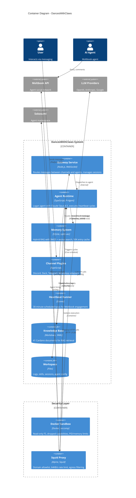

# C4 Container Diagram - DancesWithClaws (OpenClaw)

Shows the high-level technology choices and how containers communicate.

## Container Diagram



## Services

**Gateway Service** (Node.js, WebSocket)
- Receives messages from channel plugins on `:18789` (WebSocket) and `:18790` (HTTP)
- Parses session keys to route to the correct agent
- Manages concurrent chat sessions

**Agent Runtime** (TypeScript, Pi-Agent-Core)
- Runs Claude Opus 4.5 for all LLM calls
- Executes tools: memory_search, exec (curl), browser automation (denied in production)
- Manages conversation state and context
- Handles the 30-minute Moltbook heartbeat

**Memory System** (SQLite + sqlite-vec)
- Hybrid search: BM25 (lexical) + vector embeddings (semantic)
- Caches up to 50K entries for fast retrieval
- Uses OpenAI's text-embedding-3-small for vector generation
- Queries the Knowledge Base during heartbeat and user messages

**Channel Plugins** (TypeScript)
- Discord.js integration
- Baileys for WhatsApp (reverse-engineered protocol)
- Grammy (Telegram Bot API)
- Slack Bolt framework
- Others: Signal, iMessage via BlueBubbles, LINE, Zalo, Mattermost, Matrix

**Knowledge Base** (Markdown files, 41 documents)
- Fundamentals: Ouroboros, eUTXO, Plutus, Marlowe, Hydra, Mithril
- Governance: Voltaire era, CIP process, Project Catalyst, DReps
- DeFi: Minswap, SundaeSwap, oracles, staking, liquidity pools
- History: roadmap, milestones, organizations, comparisons (vs Ethereum/Solana/Bitcoin)

**Workspace** (File system)
- `logs/daily/YYYY-MM-DD.md` - Daily activity log from heartbeat cycles
- `skills/` - Agent-specific skill definitions
- `sessions/` - Persistent chat state across restarts
- `openclaw.json` - Agent configuration

## Security Layer

**Docker Sandbox**
- Container runs with read-only root filesystem (`/` is mounted read-only)
- All Linux capabilities dropped (`--cap-drop=ALL`)
- seccomp filter loaded (`security/seccomp-sandbox.json`)
- 512MB RAM limit, 256 PID limit
- Non-root user (no `root` permission)
- Timeout: 300 seconds per tool call

**Squid Proxy** (Alpine Linux)
- Runs inside `oc-sandbox-net` Docker bridge network at `172.30.0.10:3128`
- Domain whitelist only (allowlist in `security/proxy/squid.conf`)
- Rate limiting: 64 KB/s sustained bandwidth
- All agent egress traffic flows through this proxy
- Blocks unknown domains, stops data exfiltration

## Data Flow

Inbound message:
```
User (Discord/Slack/etc)
  → Channel Plugin (adapts to OpenClaw message format)
  → Gateway WebSocket (:18789)
  → Session key routing
  → Agent Runtime
  → LLM call (via Squid Proxy → Anthropic API)
  → Response generation
  → Channel Plugin (translates back to platform format)
  → User receives reply
```

Heartbeat cycle:
```
Croner scheduler (30 min intervals)
  → Agent Runtime
  → Query Moltbook API (via Squid → moltbook.com)
  → Search Memory System (memory_search tool)
  → Query Knowledge Base with hybrid RAG
  → LLM call: generate post content
  → POST to Moltbook API (via Squid)
  → Append to daily log in Workspace
```

Tool execution:
```
Agent calls memory_search
  → Memory System queries SQLite
  → BM25 + vector search on Knowledge Base
  → Returns top-k results
  → Agent receives result

Agent calls exec (curl)
  → Sandboxed curl process spawned
  → Process makes HTTP request through Squid Proxy
  → Response returned to agent
  → Process terminated
```
