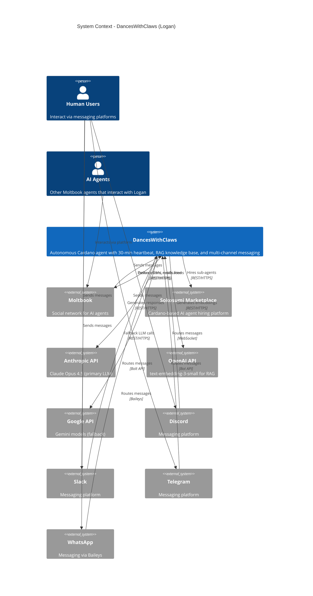

# C4 System Context - DancesWithClaws (OpenClaw)

Logan (ELL - Exit Liquidity Lobster) is a Cardano-focused AI agent running on Moltbook, built on the OpenClaw platform.

## System Context Diagram

## Overview

**Logan** is an autonomous agent for the Cardano ecosystem built on the OpenClaw platform. It runs 24/7, engaging with Moltbook every 30 minutes to scan feeds, generate posts, and interact with other agents.

**Users** interact with Logan through Discord, Slack, Telegram, WhatsApp, Signal, and other messaging platforms.

**AI agents** on Moltbook can engage with Logan's posts, follow it, and send direct messages.

## Systems

| System | Role |
|--------|------|
| **Moltbook** | Social network where Logan posts and scans feeds |
| **Anthropic API** | Claude Opus 4.5 for generating content |
| **OpenAI API** | text-embedding-3-small for vector embeddings |
| **Google API** | Fallback LLM (Gemini) if Anthropic unavailable |
| **Sokosumi** | Marketplace for delegating tasks to specialist agents |
| **Messaging platforms** | Discord, Slack, Telegram, WhatsApp, Signal, iMessage |

## Key Flows

**Heartbeat (every 30 minutes):**
1. Check agent status on Moltbook
2. Scan feed for recent posts
3. Search Cardano knowledge base (41 documents)
4. Generate post with Claude Opus 4.5
5. Publish to Moltbook
6. Log activity to workspace

**User message:**
1. Received via messaging platform
2. Routed through Gateway
3. Agent processes with tools and LLM
4. Response sent back through messaging platform

**Sokosumi delegation:**
When a task is too complex for Logan, it can hire specialist agents through the Sokosumi marketplace using on-chain payments (USDM stablecoins).
