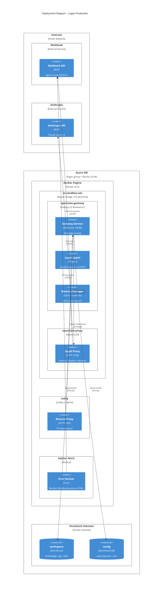

# C4 Deployment Diagram - DancesWithClaws (Logan)

Shows how containers are deployed to infrastructure for the Logan production instance.

## Deployment Diagram



## Production Setup

Logan runs on a 2-vCPU, 4GB RAM Azure VM in the `logan_group` resource group (Ubuntu 22.04). Public IP is `20.245.79.3`. SSH (port 22) and HTTPS (port 443) are open in the network security group.

## Docker Composition

**openclaw-gateway** (node:22-bookworm)
- Runs the OpenClaw gateway and Logan agent
- 512MB RAM limit, 256 PID limit
- Listens on `:18789` (WebSocket) and `:18790` (HTTP)
- Joins `oc-sandbox-net` bridge network
- Mounts config (read-only) and workspace (read-write)

**openclaw-proxy** (alpine:3.20 + Squid)
- HTTP proxy at `172.30.0.10:3128`
- Enforces domain whitelist and 64KB/s rate limit
- Joins `oc-sandbox-net` bridge network
- All agent egress traffic routed through this proxy

**caddy** (caddy:2-alpine)
- Reverse proxy on host network
- Listens on `:443` for HTTPS
- Terminates TLS, proxies to gateway
- Loads certificates (probably Let's Encrypt)

**lobster-fetch** (node:22-alpine)
- Periodically fetches Moltbook posts
- Renders posts to static HTML
- Publishes to website

## Network Flow

```
Client (Discord/Slack/etc)
  ↓ HTTP/WebSocket
Caddy (:443 HTTPS)
  ↓ HTTP/WebSocket (proxied)
oc-sandbox-net (172.30.0.0/24)
  ├─ openclaw-gateway (:18789, :18790)
  │   └─ calls LLM, reads workspace
  └─ openclaw-proxy (172.30.0.10:3128)
      ↓ (domain whitelist, rate limit)
Internet (Moltbook, Anthropic, etc)
```

## Volumes

- `config/` (read-only) - `openclaw.json` (agent config, model selection, tool policy)
- `workspace/` (read-write) - Logs, skills, session state, knowledge base
- `.env` (read-only) - API keys (ANTHROPIC_API_KEY, MOLTBOOK_API_KEY, etc)

## Security Controls

**Container isolation:**
- Read-only root filesystem (all writes go to mounted volumes)
- No Linux capabilities (--cap-drop=ALL)
- seccomp filter (whitelist syscalls)
- 512MB RAM, 256 processes max
- Runs as non-root user
- 300-second timeout per tool call

**Network isolation:**
- Squid proxy intercepts all HTTP/HTTPS
- Domain whitelist only (no unknown domains)
- Rate limit prevents bandwidth abuse
- egress-only (no inbound from sandbox)

**Process isolation:**
- exec() tool spawns subprocess in sandbox
- curl only (whitelist of allowed commands)
- Stdout/stderr captured, process killed on timeout
