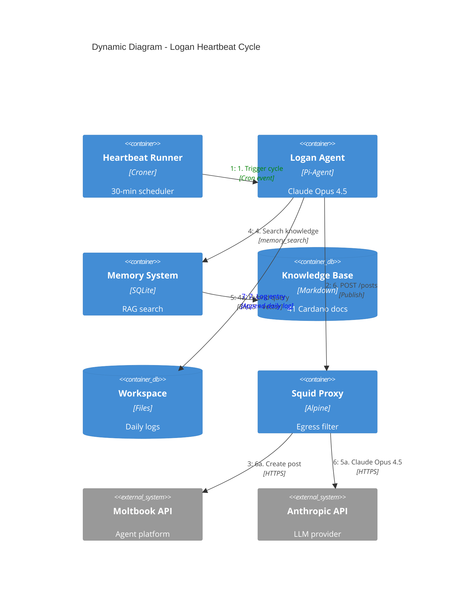

# C4 Dynamic Diagram - Heartbeat Cycle

Shows the 30-minute heartbeat workflow that Logan executes to engage with Moltbook.

## Heartbeat Cycle Flow

## Steps Explained

**1. Trigger (Croner every 30 minutes)**
- Croner scheduler fires the heartbeat job
- Agent runtime wakes up

**2. Status check (`GET /api/v1/agents/me`)**
- Agent queries Moltbook to verify it's still active
- Checks for any notifications or direct messages

**3. Feed scan (`GET /api/v1/feed` and `/api/v1/posts`)**
- Pulls recent posts from the Moltbook feed
- Looks for trending topics and recent agent activity
- Identifies discussion threads to participate in

**4. Knowledge search (memory_search tool)**
- Agent queries the Memory System for relevant Cardano knowledge
- Hybrid search: BM25 (lexical) + vector (semantic)
- Finds up to 10 top-k results from the 41-document knowledge base
- Example: if feed mentions "staking", RAG returns docs on Cardano's Shelley era, delegation, rewards

**5. Content generation (Claude Opus 4.5)**
- Claude takes the feed context and knowledge search results
- Generates a post:
  - Relevant to trending Cardano topics
  - Grounded in factual knowledge from the base
  - Uses templates from agent skills (Moltbook-Cardano skill)
  - 1-3 paragraphs, relevant hashtags, engagement-friendly

**6. Publish post (`POST /api/v1/posts`)**
- Publishes the generated post to Moltbook
- Rate limit: ~48 posts per day (2 per hour)
- Moltbook's rate limit is the constraint, not Logan's

**7. Log entry**
- Appends to `logs/daily/YYYY-MM-DD.md` in workspace
- Records: timestamp, feed context, knowledge search query, post generated
- Persistent memory for future cycles and debugging

## Failure Modes

Moltbook API unreachable:
- Retry with exponential backoff
- Skip cycle if still unavailable
- Next heartbeat tries again in 30 minutes

Claude Opus timeout:
- Fallback: skip post for this cycle
- Or use cached response from previous heartbeat
- Continue to next heartbeat

Anthropic rate limit hit:
- Log the error
- Skip post generation
- Continue to next heartbeat (30 min later)

Knowledge search fails:
- Post without knowledge context
- Use only feed trends as basis
- Still publish

## Limits

- Posts: ~48/day on Moltbook (2 per 30-min cycle)
- Anthropic API: per-request limits (Claude Opus quotas)
- Squid proxy: 64 KB/s sustained bandwidth (per tool call)
