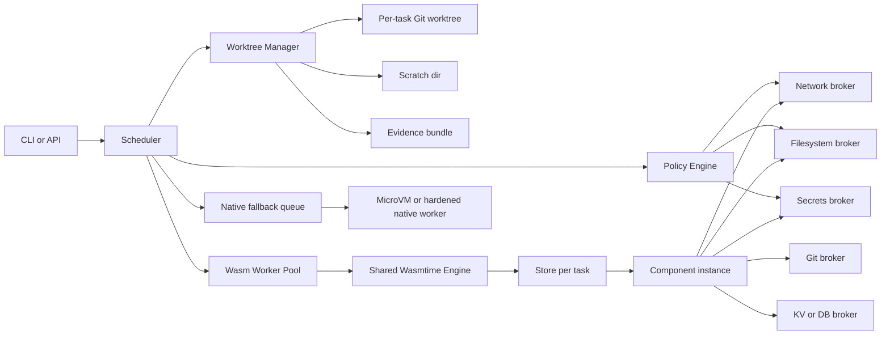
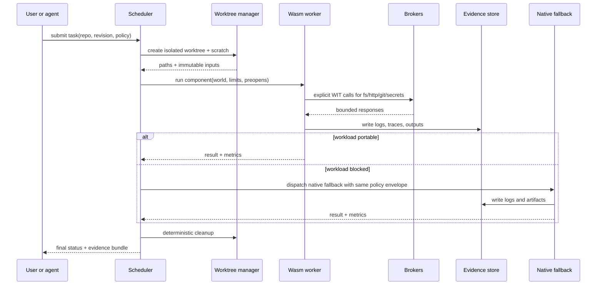

> **Ingested into dancesWithClaws** on 2026-07-13 from local research export. Informs Approach A P2+ (hybrid WASM host + native fallback). Does not replace the design spec.

# Migrating a Docker Sandbox in WSL2 to a WebAssembly Sandbox

## Executive verdict

The best target is **a WASM-first hybrid**, not an immediate full replacement of every Docker use case. In practical terms, that means: make an **embedded Wasmtime host in Rust** the primary sandbox, expose all host powers through **versioned WIT capabilities**, run the scheduler and evidence pipeline outside the guest, and keep a **narrow native fallback** for workloads that are still poor fits for standard WASI today. That recommendation follows from the current state of the standards: **WASI 0.3.0 is now stable** and adds native async, streams, and futures to the Component Model, but **runtime and guest-toolchain support is still arriving**, and Wasmtime’s `p3` host support is explicitly documented as **experimental, unstable, and incomplete** even though Wasmtime 46 ships the 0.3 interfaces by default. citeturn25view0turn25view5turn0search0turn1search5

For a sandbox that executes **untrusted or partially trusted AI-generated code**, the right migration goal is therefore **remove Docker from the hot path first**, not “pretend every Linux workload is already a portable component.” Standard WASI and the Component Model are now strong enough for a large class of bounded command-like and service-like workloads, especially those that can be expressed as explicit capabilities for filesystem, HTTP, clocks, randomness, key-value, and evidence output. They are **not yet a clean drop-in replacement** for arbitrary shell-heavy builds, arbitrary child-process trees, browser automation, GPU-first jobs, or legacy native toolchains that assume a full Linux userland. citeturn24search1turn16search20turn27view1turn27view2turn15search3

The closest production fit to your stated constraints is:

- **Primary runtime:** embedded **Wasmtime** host.
- **Interface model:** **WIT + Component Model**, with **WASI 0.2 as the conservative compatibility floor** and **WASI 0.3 selectively enabled** where your host and guest toolchains are validated.
- **Scheduling model:** one shared `Engine`, isolated `Store` per task, pooling allocator, warm pools, explicit quotas, evidence bundles, and deny-by-default networking.
- **Fallback model:** native worker pool behind the same brokered interface, preferably **microVM-backed** for the riskiest native tasks rather than “just another privileged container.” citeturn16search20turn26view5turn25view1turn26view2turn26view1turn11search7turn11search2

Under that design, **Docker can likely be retired for a meaningful percentage of sandbox tasks**, but **Docker or another native isolation layer should remain available for a minority of incompatible jobs until the workload inventory proves otherwise**. That is also the safer answer on Windows: Docker Desktop’s own documentation says the **WSL 2 backend offers reduced security isolation compared with Hyper-V**, and Microsoft recommends keeping Linux-tooling projects **inside the WSL filesystem** for best performance. So the near-term win is not only “replace Docker with Wasm,” but also “stop paying the Docker-inside-WSL control-plane tax for tasks that can run as components.” citeturn25view3turn10search0turn10search5turn10search7

### Assumptions used in this report

This recommendation assumes the sandbox must: execute untrusted or semi-trusted code; isolate work per Git worktree; deny network by default; preserve logs and other forensic artifacts; and support local development on Windows while keeping CI and production portable. It also assumes you care more about **measurable compatibility, policy control, and security posture** than about adopting the broadest marketing definition of “full WASM stack.” Those assumptions are consistent with the current Component Model and WASI positioning, which emphasize capability-secure interfaces and host-defined composition rather than wholesale emulation of a full Linux process environment. citeturn24search1turn26view0turn14search7

### Weighted decision matrix

The matrix below weights criteria this way: **compatibility 30%**, **security and policy control 30%**, **performance and parallelism 20%**, **standards alignment 10%**, **operational simplicity 10%**. The scores are this report’s assessment; the factual basis for the assessment is discussed in the following sections.

| Option                                       | Fit for this sandbox | Why                                                                                                                                                                                                                            |
| -------------------------------------------- | -------------------: | ------------------------------------------------------------------------------------------------------------------------------------------------------------------------------------------------------------------------------ |
| **Embedded Wasmtime host + native fallback** |          **4.6 / 5** | Best control surface; reference Component Model implementation; strongest embedder APIs for pooling, limits, interruption, profiling, and cache control. citeturn16search20turn25view1turn26view1turn26view2turn26view7 |
| **wasmCloud around a custom host**           |          **3.9 / 5** | Strong if you also want distributed multi-host orchestration and reusable in-process host plugins; more platform than you need for the first migration step. citeturn23search18turn27view7turn25view2                     |
| **OCI Wasm with containerd/runwasi**         |          **3.3 / 5** | Useful for Kubernetes/OCI interoperability, but it preserves containerd/OCI complexity and recently had a critical advisory around untrusted precompiled OCI artifacts. citeturn25view4turn27view0                         |
| **Spin**                                     |          **3.2 / 5** | Excellent framework for event-driven Wasm services, but that is not the same thing as a general-purpose untrusted build/test sandbox. citeturn27view6turn6search0turn6search6                                             |
| **Wasmer + WASIX**                           |          **3.1 / 5** | Helpful for legacy POSIX-leaning workloads, including spawn and sockets, but it does so through Wasmer-specific extensions rather than the WASI standards track. citeturn27view3turn8search22turn15search0                |
| **WasmEdge**                                 |          **2.9 / 5** | Attractive for sockets, AI-related extensions, and AOT options, but its Component Model support is still documented as loader/validator only in the CLI docs. citeturn5search22turn27view4turn22search3                   |
| **Extism**                                   |          **2.7 / 5** | Strong plugin-system technology with fine-grained host functions, but not a full sandbox/orchestration replacement for arbitrary repo tasks. citeturn27view5turn7search3turn7search11                                     |

## What the standards and runtimes actually support

The most important standards change since 2024 is that **WASI 0.3.0** is now officially released and moves async into the **Component Model’s canonical ABI** through `async func`, `stream<T>`, and `future<T>`. That is more than a cosmetic change: in **WASI 0.2**, components had to carry their own event-loop gymnastics via `wasi:io`; in **WASI 0.3**, the **host becomes the scheduler** for async composition across components. The Component Model documentation also makes clear that the **canonical ABI** is the lingua franca for passing typed values across component boundaries, so every cross-boundary call is explicit and type-directed rather than an implicit syscall surface. citeturn25view0turn26view6turn24search10

That standards progress is real, but it is not the same as full ecosystem maturity. The official WASI roadmap says **WASI 0.3.0 was released on June 11, 2026** and support is available in **Wasmtime 43+** and `jco`, while Wasmtime’s current WASI host docs still label `p3` support as **experimental, unstable, and incomplete**. The practical read is straightforward: **the spec has crossed an important threshold**, but you should still treat 0.3-hosting as a feature-gated deployment track until your exact guest languages and broker interfaces are validated end to end. citeturn0search0turn25view5turn25view0

### Option assessment

**Embedded Wasmtime** is the strongest foundation for this migration because it is both the **reference Component Model implementation** and the runtime with the most directly relevant embedder controls: shared `Engine`, per-`Store` resource scoping, **pooling allocator** for fast high-concurrency instantiation, **fuel** and **epoch interruption** for quotas and cancellation, built-in **compilation cache** and serialization APIs, and first-class **profiling/debugging** support. Those are exactly the primitives needed for a multi-tenant sandbox scheduler, and they are exposed as runtime APIs rather than hidden behind an orchestrator opinion. citeturn16search20turn26view5turn25view1turn26view1turn26view2turn26view3turn26view4turn26view7

**runwasi** is best understood as an interoperability layer with the container ecosystem, not as the cleanest primary substrate for your local sandbox. Its own repository describes it as a project to run Wasm workloads managed by **containerd**, intended as a Rust library you integrate into a Wasm host, with included PoCs for plain WASI hosting. That makes it reasonable when you need **OCI, CRI, and Kubernetes RuntimeClass integration**, but it is the wrong optimization target if your real task is “replace a Docker sandbox with a smaller trusted host.” The 2026 advisory on **forged Wasmtime precompiled OCI layers** is especially relevant here: patched versions must reject precompiled artifacts from OCI image layers, and the workaround explicitly says **do not run untrusted OCI images with affected `containerd-shim-wasmtime-v1` versions**. citeturn25view4turn27view0

**Spin** is a good framework when your workload can be re-expressed as **event-driven microservices**. Its documentation is explicit about that focus: Spin is for **event-driven microservice applications** with triggers such as HTTP and Redis, and it advertises millisecond cold starts. That can be very attractive for some brokered helper services around your sandbox, but it does not make Spin a direct replacement for “arbitrary repo build and test executor.” It would be better used as an adjacent service model, not as the foundational sandbox runtime. citeturn27view6turn6search0turn6search3turn6search9

**wasmCloud** is more compelling than Spin if you eventually want a **distributed Wasm platform** with reusable host-side capabilities. In v2 it moved capabilities into **in-process host plugins**, and the project’s migration guide reports roughly **6x higher throughput** for those host-provided functions than the earlier NATS-traversing provider model. Its runtime docs also show the exact pattern you care about: plugins bind **WIT worlds** directly into a `wasmtime::component::Linker`. That makes wasmCloud a very plausible **phase-two** adoption path for multi-host distribution, but still more platform than you need for the first step of replacing a Docker sandbox in WSL2. citeturn25view2turn27view7turn23search18

**Wasmer + WASIX** deserves respect as a pragmatic compatibility route, especially if your inventory shows large amounts of POSIX-leaning code that cannot be economically reworked yet. Wasmer’s docs describe **WASIX** as long-term support for the existing WASI ABI plus **additional syscall extensions** to close missing gaps, and WASIX advertises features such as **multithreading**, **sockets**, and even process-spawn tutorials. The tradeoff is architectural: that is a **Wasmer-specific extension path**, not the same thing as standardizing on WIT + mainstream WASI. For a standards-first sandbox, I would treat WASIX as an **escape hatch**, not the foundation. citeturn27view3turn8search22turn15search0

**WasmEdge** is interesting where you want aggressive cloud/AI extensions. Its docs highlight non-blocking sockets, key-value, database, gas metering, and AI-related plugins. But its CLI docs also state that **Component Model support is default-off and limited to loader/validator phase**, while threads are also default-off. That makes WasmEdge a weaker primary fit than Wasmtime for a Component-Model-centric sandbox. citeturn5search22turn27view4turn22search3

**Extism** is the clearest “not the same job” candidate. Extism is a plugin system: it supports optional WASI, custom host functions, and explicitly says plugins are **single-threaded** while the host can manage concurrency and pools. That is valuable if you want user-extensible functions embedded in an application, but it is not a complete answer to isolated build/test/task execution against Git worktrees. citeturn27view5turn7search6turn7search11

## Workload compatibility and blocker matrix

Before writing any runtime code, you need a **repo and sandbox inventory pass** that answers a narrower question than “what languages are present?” You want to know: which tasks are pure computation; which only need filesystem, clocks, randomness, HTTP, and key-value; which rely on shell pipelines or child processes; which load native extensions; which need browsers, databases, or GPUs; and which touch the network, even implicitly, through package managers or test fixtures. The outcome should classify every dependency into one of five buckets: **WASM-ready**, **portable with changes**, **host capability**, **remote service**, or **native-only fallback**. That classification is precisely how the Component Model is meant to be used: host-defined capabilities for the parts that should stay outside the guest, and portable component boundaries for the rest. citeturn24search1turn26view0turn3search2

### Compatibility matrix

| Workload feature                                | Status in a standards-first WASM stack      | Migration rule                                                                                                                                                                                                                                            |
| ----------------------------------------------- | ------------------------------------------- | --------------------------------------------------------------------------------------------------------------------------------------------------------------------------------------------------------------------------------------------------------- |
| Pure command-like compute with bounded file I/O | **Good fit**                                | Recompile to a component or core Wasm module and expose only file, clock, random, and evidence capabilities. citeturn16search20turn26view0                                                                                                            |
| HTTP client/server logic                        | **Good fit**                                | Use `wasi:http` where possible and a host network broker with explicit egress policy; for lower-level networking, use `wasi:sockets`. citeturn14search0turn14search4turn27view1                                                                      |
| Child processes and shell pipelines             | **Poor fit today**                          | Keep native fallback; standard WASI process spawning is still design-discussion territory, while WASIX offers nonstandard spawn. citeturn15search3turn15search13turn15search0                                                                        |
| Thread-heavy component internals                | **Use cautiously**                          | Core Wasm threads exist, but Component Model shared-memory support is not the portable default yet; prefer process/task parallelism first. citeturn14search1turn14search9turn14search13                                                              |
| Raw sockets, DNS                                | **Fit with policy**                         | Standard proposal exists and is capability-oriented with deny-by-default firewalling expectations. citeturn27view1                                                                                                                                     |
| TLS stacks                                      | **Use host/broker**                         | `wasi:sockets` explicitly lists SSL/TLS and HTTP(S) as non-goals of that proposal; push those concerns into host-side libraries or higher-level interfaces. citeturn27view1                                                                            |
| Git operations                                  | **Broker, do not shell out in guest**       | Prefer a host Git broker or a native helper behind WIT rather than handing the guest unfettered shell/process access. This is an architectural recommendation grounded in the lack of standardized child-process APIs. citeturn15search3turn24search1 |
| Package managers and arbitrary installers       | **Native fallback or remote build service** | `apt`, `npm`, `pip`, and similar flows often imply subprocesses, native toolchains, scripts, and unrestricted network. Treat them as nonportable until proven otherwise.                                                                                  |
| GPU / WebGPU                                    | **Not baseline-ready**                      | `wasi:webgpu` is still a proposal; keep GPU work native or in a specialized service until your exact runtime stack proves stable. citeturn27view2turn20search2                                                                                        |
| Persistent databases and external services      | **Service/plugin fit**                      | Move them out of the guest and present them as brokered WIT capabilities or external services. wasmCloud host plugins are a good reference pattern here. citeturn27view7turn23search4                                                                 |
| Browser automation / headful UI tests           | **Native fallback**                         | Keep these outside the Wasm guest boundary, ideally in a separately hardened worker or microVM.                                                                                                                                                           |

The sharpest blockers are **process trees, shells, native extensions, and GPU/browser workloads**. The official WASI materials are moving toward richer component composition, but the current standards picture is still capability-first, not “Linux-userland-in-a-box.” That is why a full-purity target is usually uneconomic for a developer sandbox before the inventory is complete. citeturn24search1turn25view0turn15search3

### What to migrate first

Start with tasks that already fit the grain of the model: formatting, static analysis, deterministic unit-test runners, small compilers/transforms, HTTP-bound helper logic, and anything that can operate on **preopened directories plus explicit broker calls**. Delay tasks that require arbitrary subprocess creation, system package installation, headless browsers, large native toolchains, or kernel-sensitive behavior. The migration order matters because early success depends on moving the **high-volume, low-variance** tasks first; those are the ones that will benefit most from Wasmtime’s pooling allocator, warm caches, and shared-engine scheduling. citeturn25view1turn26view4turn26view3

## Recommended target architecture

The target should have a **small trusted host** and treat the guest as a typed component, not a mini-VM with ambient powers. The host owns scheduling, worktree lifecycle, quotas, logging, metrics, and all network enforcement. Guests get only explicit capabilities: filesystem handles, allowed HTTP routes, key-value access, clocks, randomness, and evidence write streams. Wasmtime’s own security docs reinforce this model: filesystem access follows a **capability-based security model**, and the Component Model’s canonical ABI means inter-component communication is explicit and typed rather than ambient. citeturn26view0turn26view6

### Architecture diagram



This is the right boundary because each concern lands where the current ecosystem is strongest. Wasmtime gives you the **shared engine + isolated stores** model, resource limiters, interruption, and profiling. WIT gives you the typed capability surfaces. If you later need cross-host distribution, the wasmCloud v2 plugin and workload model is a credible way to distribute the same WIT-shaped capabilities without redesigning the guest contract. citeturn26view5turn26view1turn26view2turn27view7turn23search4

### Sequence diagram



### Local, CI, and production topology

For **local development on Windows**, a practical first step is to run the new host **inside WSL2 but without Docker** and keep the repo/worktrees **inside the WSL filesystem** because Microsoft and Docker both recommend that for Linux-tooling performance. That lets you delete Docker from the hot path before you also try to delete WSL from the workflow. For **CI and production**, run the same Rust host on Linux and keep the fallback queue on the same API contract, so the local and remote execution surfaces remain identical. citeturn10search0turn10search5turn10search7

A fully native Windows host can be a later optimization, but I would only pursue it after your inventory shows that path semantics, toolchain assumptions, and native fallback volume no longer depend heavily on Linux behavior. Docker Desktop’s own ECI limitations page is a reminder that Windows-local security semantics are not magically simplified just because Docker is present; moving to a smaller custom host is a more meaningful reduction in trust than merely keeping the same job inside a different local VM wrapper. citeturn25view3

## Parallelism and optimization plan

The right worker model is **one shared `Engine` per worker process and one `Store` per task**, with the `Engine` reused across threads and stores treated as the isolation and accounting boundary. Wasmtime documents the `Engine` as **safe to share across threads** and the pooling allocator as a way to make instantiation **faster and more scalable in terms of parallelism** by preconfiguring virtual memory and reusing slots. That lines up almost perfectly with a Git-worktree sandbox where tasks are independent and short-lived. citeturn26view5turn25view1

### Scheduler recommendation

Use a **two-level scheduler**:

- First level: **priority-partitioned queues** (`interactive`, `batch`, `native-fallback`), each with independent concurrency ceilings.
- Second level: **work stealing within a priority class**, never across hard-isolation boundaries.

The worker should keep **warm Wasm slots** for the most common component shapes, but not for native fallback workers. The main reason is that Wasmtime pooling can accelerate repeated instantiation, while native fallback jobs should optimize for containment and observability instead. citeturn25view1turn26view2

### Bounded-concurrency formula

Use a hard cap like this:

```text
parallelism =
min(
  floor((logical_cores * cpu_target) / avg_cpu_weight),
  floor((available_ram - host_headroom) / avg_task_rss),
  floor(iops_budget / avg_task_iops),
  queue_policy_cap
)
```

Where a good starting policy is:

```text
cpu_target = 0.70 for mixed latency-sensitive workloads
host_headroom = max(2 GiB, 0.15 * system_ram)
avg_task_rss = wasm_rss + broker_rss + cache_share
```

Then refine per class:

```text
interactive_cap = min(global_parallelism, floor(global_parallelism * 0.5))
batch_cap       = floor(global_parallelism * 0.8)
native_cap      = min(floor(global_parallelism * 0.25), explicit_isolation_budget)
```

That formula is intentionally conservative because **noisy-neighbor damage** in a Wasm sandbox usually comes from host-side contention before raw guest CPU becomes the bottleneck: allocator churn, filesystem pressure, evidence logging, and excessive cross-boundary calls.

### Optimization priorities

**Precompilation and trusted caches** should be first-class. Wasmtime supports cache configuration, AOT-style `compile`, and serialization/deserialization so you can skip compilation on the critical path. But that only belongs in **trusted compilation paths you control**. Both Wasmtime’s serialization API and runwasi’s 2026 advisory reinforce the same lesson: **never ingest guest-supplied or tenant-supplied native precompiled artifacts as if they were harmless cache entries**. citeturn26view3turn26view4turn2search2turn27view0

For compile strategy, use **Winch for fast compile paths** and **Cranelift for hot execution paths** when profiling proves it matters. Wasmtime’s docs describe Winch as the baseline compiler that compiles quickly but emits slower code than Cranelift. That suggests a policy split: fast-turnaround ephemeral tasks can default to Winch-backed cached artifacts, while hot or long-running workloads can promote to Cranelift-backed cache entries. citeturn26view4

For host-call optimization, reduce **call count and data copying across the canonical ABI**. The canonical ABI guarantees language interoperability, but it still means parameter/result lowering and memory movement at boundaries. Design your WIT worlds around **coarse-grained operations**—for example, “read a manifest and return parsed structure” beats “read 500 tiny files one path call at a time.” WASI 0.3’s native async also reduces a class of polling boilerplate and improves composition, so use it where your host path is validated. citeturn26view6turn25view0

For cancellation and fairness, prefer **epoch interruption** as the normal preemption mechanism and reserve **fuel** for deterministic accounting or adversarial test modes. Wasmtime documents fuel as deterministic but higher-overhead, while epochs are better suited to async yielding and cooperative timeslicing. citeturn26view2turn2search9

For observability, use both **host-level native profilers** and Wasmtime’s guest-focused tools. The official profiling docs recommend `perf` on Linux, VTune on x86 Windows/Linux, and `samply` on Linux/macOS, while the cross-platform guest profiler is available everywhere with less precision. That is a good fit for your benchmark harness: host profiler during capacity work, guest profiler during per-component optimization. citeturn26view7turn16search19

## Security model and red-team findings

A Wasm sandbox is not “safe by marketing”; it is safe only when the **host capability surface is tiny**, **policy is explicit**, and **runtime patching is disciplined**. Wasmtime’s security documentation is clear that the platform is designed to execute untrusted code safely, and its filesystem model is capability-based. But the same project also shipped substantial **April 2026 security advisories**, and NVD entries in 2026 show bugs where non-default memory-guard configurations could lead to out-of-bounds host memory effects and where a specific preopen permission combination could bypass intended write restrictions. That is not an indictment of Wasmtime; it is a reminder to design for **defense in depth**, not for “the runtime will save us.” citeturn2search3turn13search1turn13search2turn13search5turn25view6

### Required hardening controls

The host should expose **three filesystem classes only**:

- **immutable input tree** for the checked-out worktree,
- **mutable scratch tree** for task-created intermediates,
- **append-only evidence tree** for logs, snapshots, and outputs.

Do not give the guest generic mutation rights across a broad preopen. The 2026 Wasmtime/WASI preopen bug is a strong reason to keep permissions simple and narrow; even though that specific issue was fixed, a good sandbox does not rely on subtle permission combinations as its primary control plane. citeturn25view6turn26view0

Network should be **deny by default**, implemented in your **broker**, not entrusted to a generic runtime CLI. The sockets proposal itself expects capability handles and says implementations should implement **deny-by-default firewalling**. For ordinary tasks, resolve hostnames and open connections only through a host network broker that logs every outbound decision with task identity and policy reason. citeturn27view1

Quotas should combine **resource limiter**, **fuel or epochs**, and **host-call deadlines**. Wasmtime’s resource limiter covers memories, tables, and instances at the store boundary, while CPU-style limits need fuel or epochs. That means your quota model should be layered: memory/table caps at store creation, epoch deadlines during execution, and per-broker operation timeouts so a stuck DNS, HTTP, or Git call cannot become an unbounded hostage situation. citeturn26view1turn26view2turn2search1

Secrets should never enter the guest as ambient environment variables unless the task is already in the native fallback lane. For Wasm tasks, expose **short-lived brokered handles** or **single-operation secret use** through WIT, and log the act of use without logging the secret itself. This is a design recommendation rather than a standards claim, but it follows directly from the goal of limiting the trusted computing base and the explicit import model of components. citeturn24search1turn26view6

Terminal output should be treated as hostile. Wasmtime’s security docs point out that terminal escape sequences can have side effects or mislead users; Wasmtime now filters writes when output streams are attached to a terminal. For your sandbox, the better rule is stronger still: **never show guest output directly to an operator terminal without sanitization**, and persist the raw stream only in evidence storage. citeturn26view0

### When OS-process or microVM isolation is still required

Use **separate process or microVM isolation** when the workload leaves the sweet spot of standards-first Wasm. Firecracker’s own docs describe stronger workload isolation through hardware virtualization, and Kata Containers positions itself as a second isolation layer on top of container semantics. Those are the right tools for:

- arbitrary native helpers,
- browser automation,
- GPU jobs,
- package installation,
- unknown third-party binaries,
- tasks that need ambient Linux process semantics. citeturn11search7turn11search1turn11search2turn11search5

### Red-team pass

Here is the falsification test for the whole migration:

If your workload inventory shows that **more than roughly a quarter to a third of total task volume** still depends on **subprocesses, shells, package installers, browser stacks, or native extensions**, then a “pure Wasm sandbox” would not be a migration—it would be a costly compatibility theater project. The official standards and runtime evidence support that conclusion: standardized sockets exist, async composition has arrived, and componentized hosting is real; **standardized child-process semantics, portable GPU access, and fully mature 0.3 hosting across toolchains are not yet in the same place**. In that red-team scenario, the correct answer would be to keep hybrid execution permanently and optimize the Wasm path only for the compatible slice. citeturn27view1turn27view2turn15search3turn25view5turn25view0

## Benchmarks, migration path, and prototype

The benchmark program should compare **today’s Docker-in-WSL2 sandbox** against **the embedded Wasmtime host** and, if you retain one, **the fallback isolation lane**. Measure **representative repo tasks**, not toy startup tests: format/lint, a deterministic unit-test shard, a small transform/compiler task, a Git diff/status helper, and one network-brokered task with controlled egress. Wasmtime’s own profiling guidance supports using native profilers for end-to-end host and guest time, and guest profiler data for cross-platform comparability. citeturn26view7turn16search0

### Benchmark acceptance gates

Use acceptance gates like these:

| Metric                                | Gate for promotability                                               |
| ------------------------------------- | -------------------------------------------------------------------- |
| Cold start p50                        | At least **2x better** than current Docker path for compatible tasks |
| Warm start p95                        | At least **3x better** than current Docker path for compatible tasks |
| Throughput at capped concurrency      | At least **1.5x better** with equal or lower error rate              |
| Peak RSS per parallel task            | At least **25% lower** for compatible tasks                          |
| Cleanup time and evidence persistence | No regression                                                        |
| Policy overhead                       | Less than **10%** of task wall clock for common paths                |
| Fallback frequency after pilot        | Less than **20%** of task volume for “default Wasm lane” repos       |

Those are target thresholds, not facts about the current ecosystem. They intentionally leave room for the reality that Wasm will not automatically beat Docker everywhere.

### Minimal prototype

#### Suggested repository shape

```text
sandbox/
  Cargo.toml
  crates/
    host/
      src/
        main.rs
        scheduler.rs
        policy.rs
        worker.rs
        brokers/
          fs.rs
          net.rs
          git.rs
          secrets.rs
          evidence.rs
    wit/
      sandbox/
        world.wit
        fs.wit
        net.wit
        git.wit
        evidence.wit
    guests/
      task-runner/
        src/lib.rs
      manifest-lint/
        src/lib.rs
  benches/
    harness/
      run.py
      cases/
        repo_small.toml
        repo_medium.toml
  docs/
    topology.md
    threat-model.md
```

This shape keeps the trust boundary obvious: **host code**, **WIT contracts**, **guest components**, and **benchmark harnesses** are visibly separate.

#### Example WIT

```wit
package sandbox:task@0.1.0;

interface fs {
  read-file: func(path: string) -> result<list<u8>, string>;
  write-scratch: func(path: string, data: list<u8>) -> result<_, string>;
  list-dir: func(path: string) -> result<list<string>, string>;
}

interface net {
  http-request: async func(
    method: string,
    url: string,
    headers: list<tuple<string, string>>,
    body: list<u8>
  ) -> result<tuple<u16, list<u8>>, string>;
}

interface git {
  status: func() -> result<string, string>;
  diff: func(pathspec: option<string>) -> result<string, string>;
}

interface evidence {
  log-line: func(stream: string, line: string);
  write-artifact: func(name: string, data: list<u8>) -> result<_, string>;
}

world command {
  import fs;
  import net;
  import git;
  import evidence;

  export run: async func(args: list<string>) -> result<u32, string>;
}
```

This is intentionally **coarse-grained**. It minimizes boundary chatter and makes policy audit simpler.

#### Host pseudocode

```rust
fn execute_task(task: TaskSpec) -> Result<TaskResult> {
    let engine = shared_engine();              // global, shared
    let worktree = worktree_manager.prepare(&task)?;
    let policy = policy_engine.materialize(&task, &worktree)?;

    let mut store = new_store_with_limits(
        &engine,
        policy.memory_limit,
        policy.instance_limit,
        policy.epoch_budget,
    )?;

    let linker = build_linker(policy.clone(), worktree.clone())?;
    let component = load_trusted_component(&engine, task.component_ref)?;
    let command = instantiate_command(&mut store, &component, &linker)?;

    let result = run_with_deadlines(&mut store, command, task.args)?;
    evidence.finalize(&task, &worktree, &store)?;
    worktree_manager.cleanup(worktree)?;

    Ok(result)
}
```

The key policy decisions map directly to current Wasmtime features: shared engine, store-scoped limits, epoch interruption, typed component instantiation, and explicit host linkers. citeturn26view5turn26view1turn26view2turn16search20

#### CLI contract

```text
sandbox submit \
  --repo /repos/example \
  --rev HEAD \
  --component manifest-lint \
  --policy policies/default.toml \
  --network deny \
  --evidence out/evidence.json
```

And an internal “explain” mode:

```text
sandbox explain-task --repo /repos/example --rev HEAD
```

That command should tell you whether the task is routed to **WASM lane**, **brokered service lane**, or **native fallback lane**, and why.

### Gated migration path

The migration should be staged this way:

| Stage                   | Exit condition                                                                                                         |
| ----------------------- | ---------------------------------------------------------------------------------------------------------------------- |
| **Inventory**           | Every task type classified into WASM-ready, portable, brokered, remote, or native-only                                 |
| **Prototype**           | One real repo task runs in Wasmtime with worktree isolation and evidence capture                                       |
| **Parity**              | Same task passes in both Docker and Wasm lanes with equivalent outputs                                                 |
| **Adversarial testing** | Infinite loops, path traversal attempts, egress violations, oversized outputs, and log injection cases all fail safely |
| **Pilot**               | Default Wasm lane for selected repos; fallback still automatic                                                         |
| **Production**          | Wasm is default for compatible repos; Docker/native lane reduced to exception path                                     |
| **Rollback**            | Single config switch returns a repo or task class to native fallback                                                   |

### Parallel implementation backlog

The cleanest workstreams are:

| Workstream                      | Depends on        | Notes                                                    |
| ------------------------------- | ----------------- | -------------------------------------------------------- |
| Host runtime and scheduler      | none              | Shared `Engine`, store lifecycle, queueing, cancellation |
| WIT capability design           | none              | Must stabilize before broad guest migration              |
| Filesystem and evidence brokers | host runtime      | Highest security leverage                                |
| Network and secret brokers      | WIT design        | Needed for deny-by-default egress and secret discipline  |
| Guest task migration            | WIT design        | Start with deterministic utilities                       |
| Native fallback queue           | host runtime      | Keep same policy/evidence envelope                       |
| Benchmark harness               | prototype runtime | Must run on all candidate lanes                          |
| Adversarial test suite          | prototype runtime | Include path, output, quota, and egress abuse cases      |

The **critical path** is: **WIT contracts → host runtime → filesystem/evidence brokers → benchmark harness → pilot repos**. Anything that delays the WIT surface will fragment the migration.

### What remains impossible or uneconomic in pure WASM

As of July 2026, the following should still be treated as **outside the default pure-WASM target** for a sandbox like yours:

- **Arbitrary child-process and shell-centric workflows**, because standardized WASI process spawning is not yet the mainstream path. citeturn15search3turn15search13
- **GPU-first compute as a default sandbox feature**, because `wasi:webgpu` is still a proposal rather than a stable platform baseline. citeturn27view2
- **Tasks that depend on package managers, native postinstall scripts, or opaque third-party binaries**, because they collapse back into ambient process and system semantics.
- **Browser stacks and heavy UI automation**, which are still better placed behind a native isolation boundary.
- **Any workflow whose economics only work if you re-create a full Linux userland inside the host**, because that erases the main advantage of the Wasm migration: a **smaller, more inspectable, capability-brokered trusted host**. citeturn24search1turn26view0

The practical conclusion is therefore clear: **replace Docker/WSL2 with Wasm where the model is already better, not where it still has to impersonate Linux to survive**. That is the architectural path most likely to improve startup time, reduce trust surface, and make policy enforcement more explicit without turning the migration into a long compatibility detour. citeturn25view0turn16search20turn26view0turn25view3
